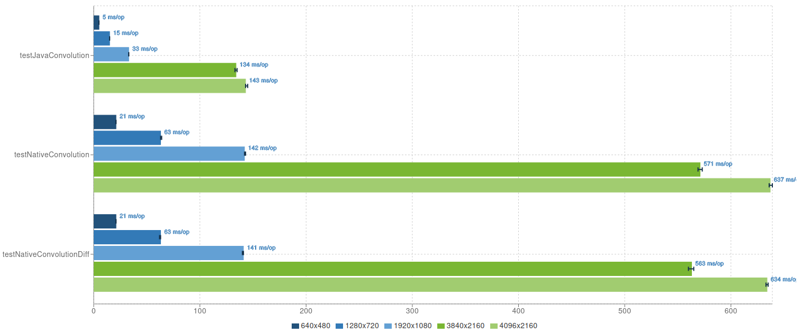
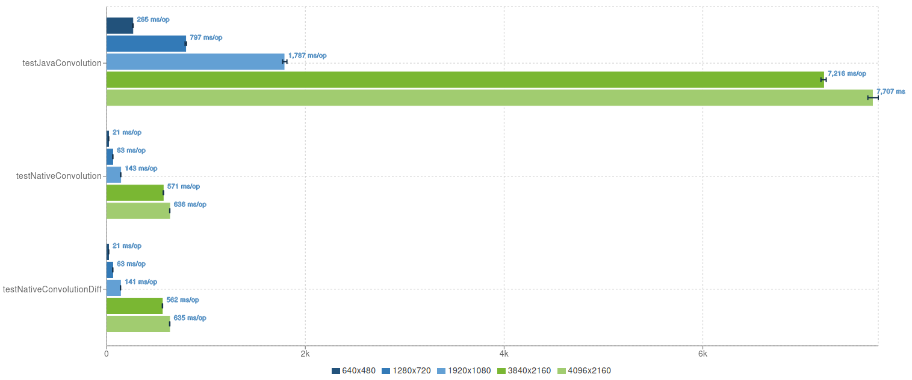

## Wyniki testów

---

### Warunki badawcze 

Do zebrania pomiarów wyników funkcji splotu (implementacja w Javie i natywna) wykorzystano
bibliotekę JMH (Java Microbenchmark Harness) z następującymi parametrami:
- wersja JMH: 1.37
- wersja VM: JDK 25.0.2, OpenJDK 64-Bit Server VM, 25.0.2+12-LTS
- Czas przeznaczony na warmup: 5 iteracji, 1 sekunda na każdą 
- Czas przeznaczony na pomiary: 10 iteracji, 1 sekunda na każdą
- Pomiary były przeprowadzanie w ramach 1 forka

---

### Plan badań

Zmierzono średni czas wykonywania się metod obliczających funkcję splotu. Badania wykonano dla następujących 
rozmiarów tablic mających odzwierciedlić prawdziwe fotografie: `{"640x480", "1280x720", "1920x1080", "3840x2160", "4096x2160"}`.
Tablicę mającą służyć za obraz wypełniono pseudolosowymi wartościami w zakresie `[0, 255]`. Analizie poddano trzy
warianty implementacji
- Java (z JIT i bez)
- Natywna wykorzystująca `GetArrayElements` (pobranie wskaźnika do tablicy)
- Natywna wykorzystująca `SetArrayRegion` (utworzenie bufora i kopiowanie regionu pamięci)

---

### Wyniki badań

Wyniki badań kodu razem z uruchomionym JIT:

Wyniki badań kodu z wyłączonym JIT:

Wytłumaczenie nazw metod:

- testJavaConvolution - implementacja Java
- testNativeConvolution - implementacja natywna z `GetArrayElements`
- testNativeConvolutionDiff - implementacja natywna z `SetArrayRegion`

---
### Wnioski

Wykresy dobrze przedstawiły różnicę w czasie wykonywania funkcji w wariancie Javy z i bez JIT.
- Z JIT: zamiana kodu bajtowego na maszynowy, co pozwala na odpowiednie optymalizacje obliczeń, czy inline wywoływanie metod pomocniczych
- Bez JIT: wynik zdecydowanie gorszy, wynika to z faktu, że każdy opcode jest interpretowany przez JVM

#### Z jit:
Nawet przy dużych obrazach, implementacja Javy jest szybsza. Może to wynikać z faktu, że natywne wywołania
muszą przesłać dane (które mogą być spore) między stertą a pamięcią natywną. Dodatkowo, wewnątrz metod natywnych
wykonywane jest dużo operacji kopiowania danych.

Badania nie wykazały większej różnicy między `GetIntArrayEelemnts` a `SetIntArrayRegion`, pomimo różnicy w dostępie
do pamięci tablicy. `GetIntArrayElements` zwraca wskaźnik do elementów tablicy, ale nie każda JVM może wspierać jej pinowanie
(blokowanie gc), a więc w takim przypadku zamiast wskaźnika do oryginalnej tablicy zwracana jest jej kopia w nonmovable 
obszarze pamięci. Metoda ta także wymaga późniejszego wywołania `ReleaseIntArrayElements` w celu zwolnienia zasobów 
i, w zależności od ustawionej flagi, skopiowania zmodyfikowanych danych z powrotem do tablicy w Javie. `SetIntArrayRegiom`
natomiast kopiuje dane wprost do jakiegoś wcześniej natywnego bufora - operacja ta nie wymaga pinowania ani zwalniania zasobów. 
Przeprowadzone badania wykazały, że wykorzystana maszyna wirtualna nie wspiera pinowania, a więc `GetIntArrayElements` i tak 
wykonywało kopię, co zniwelowało jego potencjalną przewagę nad `SetIntArrayRegion`.

---

Wykorzystane źródła wiedzy: "The Java Native Interface Programmer's Guide and Specification" (Sheng Liang) oraz Java Native Interface Specification (Oracle)

